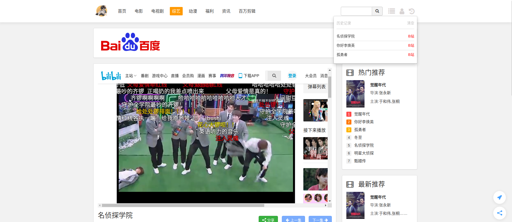

## 1.项目设计

### 1.1项目总体构成

在结构上，项目总体分为四个部分：初始化部分、静态文件部分、数据库操作部分、路由部分。

在功能上，项目分为两个部分：管理员部分和用户部分。

### 1.2引入的包

下面列举项目中引入的重要包及其作用：

mongodb：后台数据库

ejs：页面渲染

Koa：路由管理

fs：文件管理

### 1.3项目目录结构

static                 	      // 静态文件 -- 前后端页面
methods                     // 前后端数据库操作
	manage                  // 后台各个页面数据库操作方法
	public.js                  // 前端页面公共方法
	web.js                     // 前端页面方法 -- 方法
router                         // 全局路由目录 -- 接口汇总
	manage                  // 后台管理路由
	manage.js              // user管理路由
	web.js                     // user前端展示路由
middleware                // 中间件目录
	router.js                  // 用于验证各种路径
	service.js                 // 用于验证网站开启/关闭 
utils                             // 初始化文件
	authToken.js          // 验证token是否有效
	baseConnect.js      // mongodb连接
	config.js                  // 数据库配置参数设置
	initDataBase.js      // 数据库初始化

app.js                          // 项目主文件

## 2.数据库设计

系统的数据库表如下所示：

article_info：文章头部信息

article_list ：文章内容

config：显示在config页面中的预设好的内容(所以可以不足五条数据)

logs：管理员登陆日志表

message：留言及回复数据表

other：导航管理数据表

session1：session 记录表(用户)

session2：session 记录表(管理员)

​	session1、2随着系统的使用而改变，登陆时写入登陆用户数据，注销时从表中删除用户数据

user：用户数据表

video_info：视频内容结构数据表

video_list：视频播放源数据表

## 3.使用说明书

### 3.1如何运行

- 从 https://github.com/clrcjj/final/tree/master 链接中下载整个项目
- 打开项目文件，进入 utils 文件夹中(cd utils)，运行initDataBase.js文件(node initDataBase.js)，此时各张数据库表已创建好
- 退出 utils 目录(cd ..)，执行app.js文件(node app.js)

### 3.2界面展示

- 用户界面

在浏览器地址栏输入 ip 地址或 localhost：/10802 即可进入用户界面

项目首页

用户可以在各个分区浏览相应的视频或者资讯

(电视剧)

(电影)

(综艺)

(资讯)

(百万剪辑)

上述影视或资讯资源仅供测试时录入，下载本项目者可届时自行录入

资源检索功能

播放视频

浏览资讯

某些资讯在管理员设置下会和影片相关联

上述功能都是在未登录状态下就可以使用。

用户注册

此时注册了一个用户user8

用户登陆

个人中心

修改昵称

获取所有视频列(点击右上角搜索框旁的符号，可以根据头部导航分类检索)

在本站浏览过一些视频后会有浏览记录

可清空浏览记录

发表留言和评论

- 管理员界面

## 4.开发日记

commit对应内容，不重要的提交没有列出

1. 测试git连接
2. 创建项目，npm相关包
3. 上传初始化数据库的语句 initDataase.js
4. mongo数据库的连接建立
5. static静态文件
6. 对于文章的增删改查操作
7. 对于广告的增删改查操作
8. 外链、日志等操作
9. 管理员登录界面验证
10. 对于视频、用户等对象的操作
11. 首页入口、其他操作
12. logo上传
13. 前端页面方法
14. 后台系统路由
15. 前端展示管理路由
16. 中间件目录
17. 错误纠正
18. bug修复
19. 前端页面修改
20. 一些图片资源的上传
21. 功能模块的调整
22. 项目说明

## 项目部署

特此鸣谢cms管理系统作者
